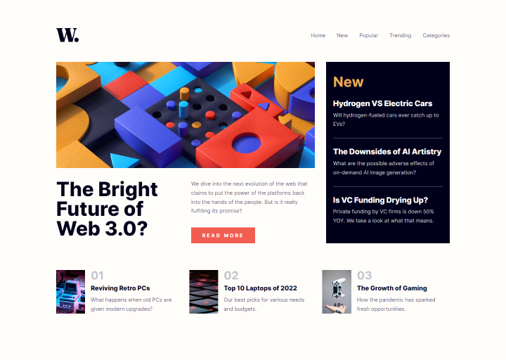
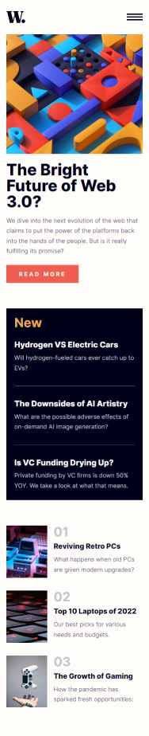

# Frontend Mentor - News homepage solution

This is Max Ruuen's solution to the [News homepage challenge on Frontend Mentor](https://www.frontendmentor.io/challenges/news-homepage-H6SWTa1MFl). Frontend Mentor challenges help you improve your coding skills by building realistic projects.

## Table of contents

- [Overview](#overview)
  - [The challenge](#the-challenge)
  - [Screenshot](#screenshot)
  - [Links](#links)
- [My process](#my-process)
  - [Built with](#built-with)
  - [What I learned](#what-i-learned)
  - [Continued development](#continued-development)
- [Author](#author)

## Overview

### The challenge

Users should be able to:

- View the optimal layout for the interface depending on their device's screen size
- See hover and focus states for all interactive elements on the page

### Screenshot

#### Desktop

#### Mobile

### Links

- Solution URL: [Frontend Mentor](https://www.frontendmentor.io/solutions/news-homepage-site-with-scss-VToeQ3mvk2)
- Live Site URL: [Cloudflare Pages](https://mbr-challenge-news-homepage.pages.dev/)

## My process

### Built with

- HTML5 / SCSS
- CSS Grid & Flex

### What I learned

This challenge was a good chance to practice my grid skills and also start working with `clamp()` for font sizes more often. I tried to make the site responsive on every single screen size (including larger desktop screens) while ensuring the mobile and 1440px wide desktop layout states are as close to pixel perfect as I can get to the reference FEM challenge design images.

Definitely need more time to practice `clamp()` but I think the usage on this site taught me a lot about this tool. Also had a lot of fun working with a static site after spending time away from these projects working on backend & React frontend stuff.

### Continued development

The 4k layout could use a little bit of work, I am getting used to designing for 4k in 50% zoom on my 2k monitor and it's hard to gauge whether users of 4k want extra space or huge text. Will need to do some reading and review other sites to hone this skill a bit.

I think this site could look better with some more example content sections below the popular articles list. I want to revisit this challenge in future and flesh out the page a bit; maybe add more article sections & a page footer, then also style out some individual article pages with lorem ipsum text.

Also need to optimise the images so that they're provided in .webp format and potentially reduce some points of CLS on mobile.

## Author

- Frontend Mentor - [@ruuen](https://www.frontendmentor.io/profile/ruuen)
- Twitter - [@maxruuen](https://www.twitter.com/maxruuen)
